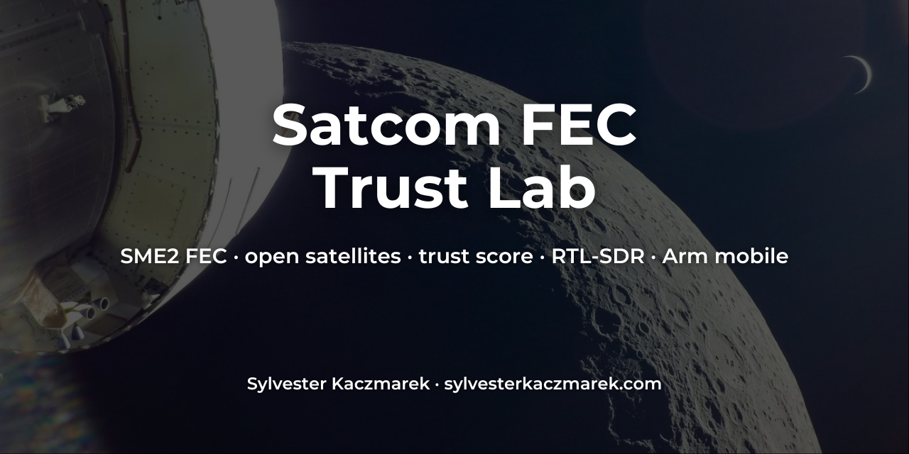

# Satcom FEC Trust Lab
[](https://github.com/sylvesterkaczmarek/satcom-fec-trust-lab/actions/workflows/android-build.yml)
[](LICENSE)
[](https://developer.android.com/)
[](#)



Pocket sized satellite lab on Arm mobile. A phone with an RTL-SDR decodes open satellite signals with LDPC and Viterbi on SME2, compares against a NEON baseline, and computes a simple link trust score. Includes synthetic IQ clips and configs for Φsat-2 compatible replay and Arm cloud runs.

## Project overview

- Phone + RTL-SDR capture open VHF / UHF satellite signals intended for public reception.
- C / C++ core runs DSP, framing, demodulation, and FEC via JNI.
- SME2 code paths accelerate the inner loops of LDPC and Viterbi, NEON is kept as a baseline.
- Trust layer computes simple link health features and a scalar trust score that can drop or abstain when things look off.
- Synthetic Φsat-2 like clips provide a mission inspired replay preset without redistributing proprietary RF.
- Same decoder and trust logic can run on Arm based cloud instances (for example Graviton) for batch analysis.

## Why this is useful

- Shows SME2 in a non CV workload that RF and satcom engineers actually care about.
- Gives a reproducible satcom pipeline developers can run on a phone and on Arm cloud.
- Adds a basic trust score on top of FER and Eb/N0, which is closer to what RPO / ISAM rehearsals need.
- Keeps data and licensing clean by using open satellites and synthetic IQ, so the repo stays public friendly.

## Features

- Satcom receive and decode path that runs on an Armv9 phone with SME2 support.
- LDPC and Viterbi FEC with SME2 vector kernels and a NEON baseline for comparison.
- Trust monitors that compute simple link health features and a scalar trust score.
- Replay path for Φsat-2 like links using synthetic IQ recordings.
- Optional Arm based cloud path for batch analysis on Graviton.
- Helper scripts and a notebook stub for metrics, plots, and trace inspection.

## Requirements

- Android Studio (current stable) with Android SDK and NDK installed.
- CMake support enabled in Android Studio.
- Armv9 phone with SME2 support, or an emulator or device for basic UI testing.
- An RTL-SDR stick for real RF tests (optional for initial bring up).

## Quick start

Clone and open in Android Studio:

```bash
git clone https://github.com/sylvesterkaczmarek/satcom-fec-trust-lab.git
cd satcom-fec-trust-lab
```

In Android Studio:

1. Open the project from this folder.
2. Let Gradle sync and CMake configure the native module.
3. Build and run the `app` module on an Arm device or emulator.

From the command line you can also assemble a debug APK:

```bash
./gradlew :app:assembleDebug
```

## Status

This repo is a work in progress. First milestone:

1. Load a canned IQ file of an open satellite demo signal.
2. Run the full DSP and FEC chain on device with NEON.
3. Switch to SME2 kernels and compare throughput and energy per bit.
4. Produce a simple plot and a trust score timeline.

Next milestones add live RTL-SDR capture, richer trust features, and a polished Arm style demo flow.

## File layout

```text
satcom-fec-trust-lab/
├─ .gitignore
├─ LICENSE
├─ README.md
├─ app/
│  └─ src/main/
│     ├─ java/com/sylvesterkaczmarek/satcomfec/...   # Kotlin UI and wiring
│     ├─ cpp/                                       # DSP, FEC, trust (C/C++)
│     └─ assets/                                    # Golden vectors, demo IQ
├─ data/
│  ├─ synthetic/                                    # Synthetic Φsat-2 like IQ
│  └─ examples/                                     # Open satellite demo data
├─ scripts/                                         # Metrics and synthetic IQ tools
├─ docs/                                            # Narrative, architecture, trust notes
├─ .github/workflows/                               # CI config
├─ ci/                                              # Local CI helpers
└─ tests/                                           # Unit tests and golden vectors
```

## Data and licensing

- Live reception is limited to satellites whose operators clearly permit public or amateur reception.
- All IQ recordings shipped in `data/` are synthetic or derived from public link parameters, not redistributed proprietary mission RF.
- Φsat-2 is treated as a mission class reference; the repo uses Φsat-2 like configurations rather than real Φsat-2 RF or TT&C data.

## License

MIT. See [LICENSE](LICENSE).

© **Sylvester Kaczmarek**
