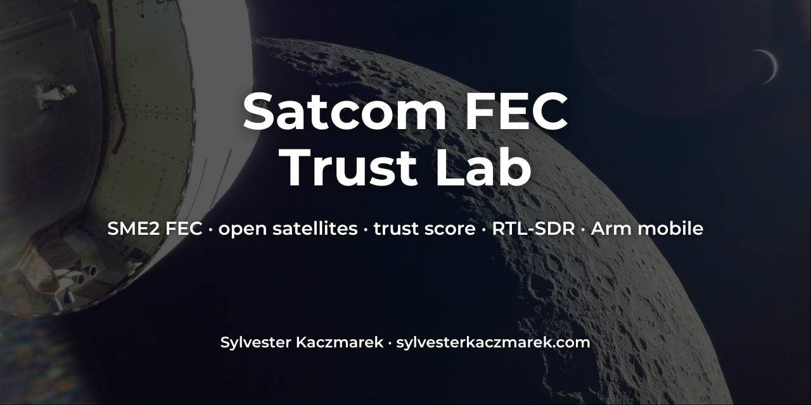

# Satcom FEC Trust Lab



This repository ships a small, deterministic satcom replay demo built from the
native C++ sources in `app/src/main/cpp/`. The supported public workflow is a
host-side runner that loads a canned IQ file, performs front-end normalization,
demodulates oversampled BPSK, finds a sync word, decodes a convolutionally
coded frame with Viterbi, checks a CRC-8 byte, and reports a simple trust
score.

The public repo provides a scoped host-side replay demo, not a supported
Android app or full SME2-optimized mobile decoder.

The `app/` directory name is historical in this revision. Only
`app/src/main/cpp/` is part of the supported public path.

## Repo status

- Publication-safe today: the host-side canned replay flow
- Included validation: host-side automated tests and host CI
- Not included: Android app packaging, JNI/mobile replay wiring,
  SME2-specific decoder kernels, live RF capture, benchmark claims, or thermal
  claims

## What is included

- A checked-in synthetic IQ recording at
  `data/synthetic/canned_replay/demo_conv_bpsk.iq`
- Metadata for that recording at
  `data/synthetic/canned_replay/demo_conv_bpsk.json`
- A host-side runner at `scripts/run_replay_demo.sh`
- A verification script at `scripts/check_replay_demo.sh`
- A decoder alignment check at `scripts/validate_decoder_alignment.sh`
- A local benchmark harness at `scripts/benchmark_decoder_paths.sh`
- Automated tests at `tests/test_host_replay.py`
- Host CI at `.github/workflows/host-replay.yml`
- Native C++ modules for front-end processing, framing, Viterbi decode, a small
  LDPC-style bit-flip decoder, and trust scoring

## What the supported demo does

The canned replay frame carries the ASCII payload `SATCOM DEMO OK`. The
generator script appends a CRC-8 byte, convolutionally encodes the payload with
a rate-1/2 code using generators `(7, 5)` in octal, prepends a 16-bit sync
word, and modulates the result as oversampled BPSK in interleaved float32 IQ.

The replay runner reports:

- decoded text
- CRC result
- sync correlation score
- mean absolute LLR
- trust score

## Quick start

Requirements for the supported quick start:

- `bash`
- `c++` with C++17 support
- `python3`
- `jq` for the validation scripts

Run the checked-in replay:

```bash
bash scripts/run_replay_demo.sh
```

Verify the canned replay result:

```bash
bash scripts/check_replay_demo.sh
```

Validate that both decoder entrypoints operate on the same prepared frame and
produce the same decoded output:

```bash
bash scripts/validate_decoder_alignment.sh
```

Regenerate the canned IQ asset and metadata:

```bash
python3 scripts/generate_synthetic_iq.py
```

Run the alternate decoder entrypoint:

```bash
bash scripts/run_replay_demo.sh data/synthetic/canned_replay/demo_conv_bpsk.iq viterbi-sme2
```

Run the local timing harness:

```bash
bash scripts/benchmark_decoder_paths.sh
```

The supported quick start does not use Gradle. No Gradle wrapper or Android
build entrypoint is included in this publication-scoped revision.

## SIMD implementation status

- `viterbi-neon`: real implementation on Arm NEON targets. The checked-in NEON
  work is branch-metric preparation; add-compare-select and traceback remain
  shared with the reference decode core.
- `viterbi-sme2`: simplified implementation. It uses the same scalar decode
  core and does not include an SME2-specific kernel.
- `ldpc-neon` and `ldpc-sme2`: simplified implementations. Both use the same
  bit-flip reference decoder and are not benchmark targets in this repository.

See `docs/simd_status.md` for the exact wording used in the codebase.

## What this repository does not claim

- It does not ship a live RTL-SDR capture path.
- It does not ship an Android replay app path.
- It does not ship a mobile JNI bridge or on-device replay workflow.
- It does not claim an SME2 acceleration result.
- It does not ship a mission-derived or Φsat-2 replay asset.
- It does not claim benchmark reproducibility, thermal behavior, or cross-device
  performance conclusions.

The repository includes a local timing harness so developers can measure their
own machine, but the README does not turn those local measurements into general
performance claims.

## Reproducibility

What works today:

- build and run the host-side canned replay flow
- regenerate the synthetic IQ asset and its metadata
- compare the `viterbi-neon` and `viterbi-sme2` entrypoints on the same canned
  input and evaluation window

Required hardware:

- a development machine with a C++17-capable `c++` compiler

Optional hardware:

- an Arm64 machine with NEON support if you want the checked-in NEON kernel to
  execute as NEON rather than the portable fallback

What is synthetic:

- `data/synthetic/canned_replay/demo_conv_bpsk.iq`
- `data/synthetic/canned_replay/demo_conv_bpsk.json`
- the replay payload and waveform produced by `scripts/generate_synthetic_iq.py`

What is not included:

- a public notebook
- live satellite captures
- mission-derived replay data
- a checked-in Gradle wrapper or Android build workflow
- a supported Android app
- an SME2-specific kernel

## Expected output

The replay runner prints JSON similar to:

```json
{
  "ok": true,
  "decoder": "viterbi-neon",
  "implementation_class": "real",
  "implementation_summary": "Real implementation on Arm NEON targets: NEON precomputes branch metrics; add-compare-select and traceback remain shared scalar reference code.",
  "decoded_text": "SATCOM DEMO OK",
  "crc_ok": true,
  "sync_score": 16,
  "mean_abs_llr": 123.619,
  "trust_score": 1,
  "error": ""
}
```

The benchmark harness prints its assumptions inline. In the current repository
those assumptions are:

- same canned IQ file for both paths
- same samples-per-symbol setting
- same framed coded-bit window
- same decoder state machine and traceback logic
- same timed iteration count inside one process

## Script inventory

Supported host-side scripts:

- `scripts/run_replay_demo.sh`
- `scripts/check_replay_demo.sh`
- `scripts/validate_decoder_alignment.sh`
- `scripts/benchmark_decoder_paths.sh`
- `scripts/generate_synthetic_iq.py`

Automated validation:

- `tests/test_host_replay.py`
- `.github/workflows/host-replay.yml`

## Repository layout

```text
satcom-fec-trust-lab/
├─ .github/workflows/host-replay.yml # Clean-checkout host CI
├─ README.md
├─ app/src/main/cpp/                 # Native replay pipeline sources
├─ assets/social/                   # Repository artwork
├─ data/synthetic/canned_replay/    # Checked-in demo IQ and metadata
├─ docs/                            # Short notes for the public demo
├─ scripts/                         # Asset generation and replay scripts
├─ tests/                           # Automated host replay checks
└─ tools/                           # Host-side replay runner source
```

## License

MIT. See [LICENSE](LICENSE).
