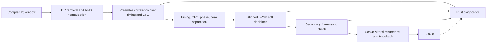

# Pocket Satcom Acquisition and Trust Lab

A host-side C++17 lab for finding a known satellite-signal preamble in complex
IQ, estimating timing and carrier-frequency offset (CFO), aligning a synthetic
frame, decoding it, and reporting inspectable trust diagnostics.

The primary engineering workload is a bank of matched-filter correlations over
many timing offsets and CFO hypotheses. The repository provides a scalar
correctness oracle, an Arm NEON implementation, and an opt-in Arm SME2
implementation that accumulates four scalable vectors in ZA.

All public captures are deterministic synthetic fixtures. This is not a live
receiver or an operational satellite waveform implementation.

## Quick start

Requirements: CMake 3.22+, a C++17 compiler, Python 3, Bash, Make, and `jq`.

```sh
make build
make replay
make compare-trust
make check-acquisition
make test
```

`make replay` runs checked-in float32 IQ through acquisition, CFO/phase
correction, BPSK demodulation, frame sync, scalar Viterbi decode, CRC-8, and
trust scoring. The expected payload is `SATCOM DEMO OK`.

For the complete clean-checkout correctness workflow:

```sh
make verify
```

## Problem and scope

For received IQ `r`, known preamble `p`, timing hypothesis `tau`, CFO
hypothesis `f`, sample rate `Fs`, and preamble length `L`, acquisition computes:

```text
C(tau, f) = sum(n=0..L-1) r[tau+n] * conj(p[n]) * exp(-j 2 pi f n / Fs)
S(tau, f) = |C(tau, f)|^2
```

The highest score selects timing and CFO. The second-highest score provides an
explicit ambiguity signal. The replay rejects weak or insufficiently separated
peaks before demodulation.

Implemented acquisition paths:

| Path | Implementation | Availability behavior |
| --- | --- | --- |
| `reference` | Scalar float64 correlation oracle | Portable |
| `neon` | Float32 NEON complex multiply-accumulate | Runs only when the NEON kernel is compiled |
| `sme2` | Float32 ZA VGx4 `FMLA`/`FMLS` across timing tiles | Runs only when SME2 compilation and runtime checks pass |

An unavailable accelerated path reports `unavailable`; it never executes
scalar code under an accelerated label. Reference, NEON, and SME2 use the same
candidate grid. Accelerated results must pass candidate-identity and numerical
tolerance checks against the scalar oracle before benchmark timing is valid.

## Architecture


```mermaid
flowchart LR
    IQ["Complex IQ window"] --> FE["DC removal and RMS normalization"]
    FE --> ACQ["Preamble correlation over timing and CFO"]
    ACQ --> EST["Timing, CFO, phase, peak separation"]
    EST --> DEMOD["Aligned BPSK soft decisions"]
    DEMOD --> SYNC["Secondary frame-sync check"]
    SYNC --> FEC["Scalar Viterbi recurrence and traceback"]
    FEC --> CRC["CRC-8"]
    ACQ --> TRUST["Trust diagnostics"]
    DEMOD --> TRUST
    SYNC --> TRUST
    CRC --> TRUST
```

IQ acquisition is the primary synchronization mechanism. The later 16-bit
frame-sync check confirms alignment after demodulation; it is not labeled as
IQ acquisition.

The replay defaults to the scalar Viterbi decoder. An optional NEON path
accelerates branch-metric preparation only; add-compare-select and traceback
remain scalar. No accelerated LDPC implementation is claimed.

## Reproduce by platform

### Ordinary desktop

Portable builds execute scalar acquisition and the complete replay. On non-Arm
hosts, NEON and SME2 checks report unavailable without failing the portable
workflow.

```sh
make verify
```

This checks fixture hashes, strict warnings, source-specific compile flags,
CTest, Python regressions, replay/trust/FEC validation, and ASan/UBSan.

### Arm64 with NEON

```sh
bash scripts/check_acquisition_neon.sh --require-neon
bash scripts/verify_acquisition_neon.sh
```

These commands require native Arm64 NEON execution. The verifier also inspects
the NEON object for vector load/deinterleave and floating-point arithmetic, and
checks that the scalar oracle does not contain the equivalent vector kernel.

### SME2-capable Arm device

```sh
bash scripts/check_sme2_acquisition.sh --require-sme2
bash scripts/verify_sme2_acquisition_assembly.sh
```

The first command requires real SME2 execution. The second requires emitted
streaming-mode boundaries, ZA transfers, and VGx4 ZA `FMLA`/`FMLS`; a feature
macro alone is insufficient.

### Android target

The Android surface is an `arm64-v8a` command-line acquisition benchmark for
`adb shell`, not an APK or Android application. Without a phone, the NDK build
and object evidence can be checked with:

```sh
bash scripts/verify_android_benchmark_build.sh --sme2 auto
```

Device execution additionally requires an authorized Arm64 phone visible to
ADB. The exact build, push, runtime-gating, and result-retrieval procedure is in
[docs/android_benchmark.md](docs/android_benchmark.md). No Android performance
result is checked into this repository.

## Replay and trust cases

The checked replay fixtures exercise distinct outcomes:

| Case | Acquisition | Decode/CRC | Trust outcome |
| --- | --- | --- | --- |
| healthy | correct, separated peak | expected payload, CRC pass | high-confidence |
| impaired | correct, weaker evidence | expected payload, CRC pass | guarded |
| ambiguous | correct, competing peak | expected payload, CRC pass | guarded |
| failed | accepted | corrupted frame, CRC failure | low-confidence |
| no-signal | rejected | demodulation not attempted | low-confidence |

Trust inputs include normalized acquisition peak, best-to-second-best
separation, residual uncertainty, bounded soft-decision strength, secondary
frame-sync evidence, demodulation clipping, and CRC state. The score and bands
are deterministic demo heuristics, not calibrated probabilities or operational
assurance levels. See [docs/trust_monitors.md](docs/trust_monitors.md).

## Checked performance evidence

The repository contains one tracked performance result set:
[benchmarks/results/a83cd53](benchmarks/results/a83cd53/README.md). It contains
five independent clean-tree process runs from source commit
`a83cd53ffe153fa69329194174f735d0a972380d`.

Recorded platform and build:

- Apple M5 Pro, device model `Mac17,9`, Darwin 25.6.0 arm64;
- Apple Clang 21.0.0 (`clang-2100.1.1.101`);
- common flags `-O3 -DNDEBUG -std=c++17`;
- reference flags `-fno-vectorize -fno-slp-vectorize`;
- NEON flags `-mcpu=native+nosve+nosve2+nosme+nosme2`;
- SME2 flags `-mcpu=native+sme2`, with runtime SME2 and 512-bit streaming
  vector length reported by the host.

The table below reports **per-capture median latency**, using the median of the
five process-level medians. Per-capture timing reuses the preamble/CFO plan but
includes SME2 packing for each new IQ window. The comparison baseline is NEON.

| Workload | Correlations | Reference ms | NEON ms | SME2 ms | NEON latency / SME2 latency across runs | SME2 temporary bytes |
| --- | ---: | ---: | ---: | ---: | ---: | ---: |
| small | 5,120 | 0.232264 | 0.063225 | 0.051513 | 1.166-1.247x | 565,248 |
| medium | 36,864 | 3.295987 | 0.855379 | 0.375940 | 2.202-2.290x | 4,489,216 |
| large | 278,528 | 49.491479 | 12.590271 | 10.323333 | 1.215-1.261x | 35,782,656 |
| very-large | 819,200 | 291.876208 | 75.972875 | 62.420666 | 1.200-1.217x | 140,771,328 |

In this checked result set, SME2 had lower median latency than NEON in all
twelve workload/mode combinations. The result does not show a crossover where
SME2 loses, but it does show strong sensitivity to workload and timing
contract: small setup-inclusive speedup was only 1.015-1.050x, while medium
per-capture was 2.202-2.290x. The sample-major SME2 workspace is a significant
cost and reaches 140,771,328 temporary bytes for `very-large`.

These are local measurements from one computer. CPU affinity, frequency, and
thermal state were not controlled; energy was not measured. They do not prove
speedup on another processor, Android phone, capture distribution, or waveform.
Raw samples, correctness records, execution order, and all three timing modes
are preserved in the result directory.

Run a non-authoritative local smoke benchmark with:

```sh
bash scripts/benchmark_acquisition.sh \
  --workload small \
  --warmup-rounds 1 \
  --samples 3 \
  --min-sample-ms 5 \
  --json build/acquisition-smoke.json
```

See [docs/benchmarking.md](docs/benchmarking.md) for the fixed workload and
fairness contract. CI timing is used only as a smoke check.

## What this project proves

- A deterministic synthetic IQ frame can be acquired over timing and CFO,
  aligned, demodulated, convolutionally decoded, and CRC checked end to end.
- Scalar, NEON, and genuine ZA-backed SME2 acquisition kernels can be checked
  for candidate identity and bounded numerical agreement.
- Accelerated translation units can be isolated and verified at object-code
  level without relabeling fallback code.
- Healthy, impaired, ambiguous, CRC-failed, and no-signal inputs produce
  inspectable and reproducible trust diagnostics.
- On the single checked Apple M5 Pro result set, SME2 acquisition latency was
  lower than NEON for the fixed synthetic workloads and timing contracts shown
  above.

## What it does not prove

- Live RF reception, tracking loops, or compatibility with a deployed air
  interface.
- Mission-specific or PhiSat-2 operational behavior.
- Calibrated acquisition probability, trust probability, or security/anomaly
  detection performance.
- Full Viterbi, full FEC, or LDPC acceleration with SME2.
- Android application support or Android performance.
- General NEON/SME2 speedup, thermal behavior, power, energy, or performance on
  hardware other than the checked result host.

## Repository map

- `src/acquisition/`: acquisition plan, scalar oracle, NEON, SME2, and dispatch
- `src/demo/`: IQ-to-payload replay orchestration
- `src/dsp/`: normalization, BPSK soft decisions, and secondary frame sync
- `src/fec/`: scalar convolutional decoder and supporting FEC utilities
- `src/trust/`: trust features, score breakdown, and status flags
- `tools/`: supported host CLIs and correctness executables
- `experiments/viterbi_branch_metrics/`: historical non-primary FEC experiment
- `data/synthetic/`: deterministic IQ fixtures and ground-truth metadata
- `benchmarks/results/`: tracked local acquisition timing evidence
- `tests/`: Python regressions and structured golden-output subsets

## Technical documentation

- [Acquisition design](docs/acquisition_design.md)
- [SME2 kernel design](docs/sme2_acquisition.md)
- [Benchmark methodology](docs/benchmarking.md)
- [Reproducibility](docs/reproducibility.md)
- [Architecture](docs/architecture.md)
- [Implementation status](docs/simd_status.md)
- [Technical review guide](docs/technical_review.md)
- [Android native benchmark](docs/android_benchmark.md)
- [Data sources and licensing](docs/data_sources_and_licensing.md)

## License

See `LICENSE`.
