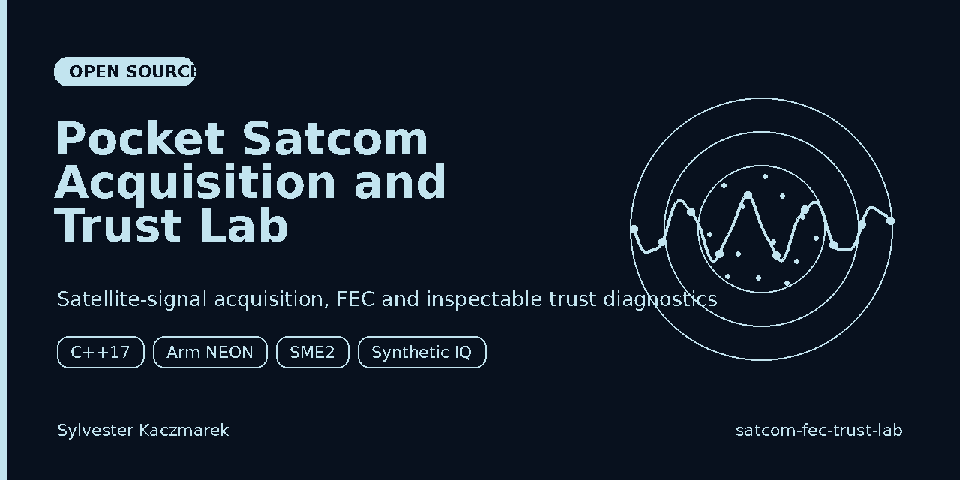
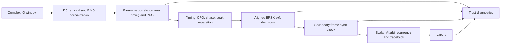

# Pocket Satcom Acquisition and Trust Lab



A host-side C++17 lab for finding a known satellite-signal preamble in complex
IQ, estimating timing and carrier-frequency offset (CFO), aligning a synthetic
frame, decoding it, and reporting inspectable trust diagnostics.

The primary engineering workload is a bank of matched-filter correlations over
many timing offsets and CFO hypotheses. The repository provides a scalar
correctness oracle, an Arm NEON implementation, and an opt-in Arm SME2
implementation that accumulates four scalable vectors in ZA.

All public captures are deterministic synthetic fixtures. This is not a live
receiver or an operational satellite waveform implementation.

## Quick start

Requirements: CMake 3.22+, a C++17 compiler, Python 3, Bash, Make, and `jq`.

```sh
make build
make replay
make compare-trust
make check-acquisition
make test
```

`make replay` runs checked-in float32 IQ through acquisition, CFO/phase
correction, BPSK demodulation, frame sync, scalar Viterbi decode, CRC-8, and
trust scoring. The expected payload is `SATCOM DEMO OK`.

For the complete clean-checkout correctness workflow:

```sh
make verify
```

## Problem and scope

For received IQ `r`, known preamble `p`, timing hypothesis `tau`, CFO
hypothesis `f`, sample rate `Fs`, and preamble length `L`, acquisition computes:

```text
C(tau, f) = sum(n=0..L-1) r[tau+n] * conj(p[n]) * exp(-j 2 pi f n / Fs)
S(tau, f) = |C(tau, f)|^2
```

The highest score selects timing and CFO. The second-highest score provides an
explicit ambiguity signal. The replay rejects weak or insufficiently separated
peaks before demodulation.

Implemented acquisition paths:

| Path | Implementation | Availability behavior |
| --- | --- | --- |
| `reference` | Scalar float64 correlation oracle | Portable |
| `neon` | Float32 NEON complex multiply-accumulate over timing tiles | Runs only when the NEON kernel is compiled |
| `sme2` | Float32 ZA VGx4 `FMLA`/`FMLS` across timing tiles | Runs only when SME2 compilation and runtime checks pass |

An unavailable accelerated path reports `unavailable`; it never executes
scalar code under an accelerated label. Reference, NEON, and SME2 use the same
candidate grid. Accelerated results must pass candidate-identity and numerical
tolerance checks against the scalar oracle before benchmark timing is valid.

## Architecture


```mermaid
flowchart LR
    IQ["Complex IQ window"] --> FE["DC removal and RMS normalization"]
    FE --> ACQ["Preamble correlation over timing and CFO"]
    ACQ --> EST["Timing, CFO, phase, peak separation"]
    EST --> DEMOD["Aligned BPSK soft decisions"]
    DEMOD --> SYNC["Secondary frame-sync check"]
    SYNC --> FEC["Scalar Viterbi recurrence and traceback"]
    FEC --> CRC["CRC-8"]
    ACQ --> TRUST["Trust diagnostics"]
    DEMOD --> TRUST
    SYNC --> TRUST
    CRC --> TRUST
```

IQ acquisition is the primary synchronization mechanism. The later 16-bit
frame-sync check confirms alignment after demodulation; it is not labeled as
IQ acquisition.

The replay defaults to the scalar Viterbi decoder. An optional NEON path
accelerates branch-metric preparation only; add-compare-select and traceback
remain scalar. No accelerated LDPC implementation is claimed.

## Reproduce by platform

### Ordinary desktop

Portable builds execute scalar acquisition and the complete replay. On non-Arm
hosts, NEON and SME2 checks report unavailable without failing the portable
workflow.

```sh
make verify
```

This checks fixture hashes, strict warnings, source-specific compile flags,
CTest, Python regressions, replay/trust/FEC validation, and ASan/UBSan.

### Arm64 with NEON

```sh
bash scripts/check_acquisition_neon.sh --require-neon
bash scripts/verify_acquisition_neon.sh
```

These commands require native Arm64 NEON execution. The verifier also inspects
the NEON object for vector load/deinterleave and floating-point arithmetic, and
checks that the scalar oracle does not contain the equivalent vector kernel.

### SME2-capable Arm device

```sh
bash scripts/check_sme2_acquisition.sh --require-sme2
bash scripts/verify_sme2_acquisition_assembly.sh
```

The first command requires real SME2 execution. The second requires emitted
streaming-mode boundaries, vector IQ load/deinterleave, ZA transfers, and VGx4
ZA `FMLA`/`FMLS`; a feature macro alone is insufficient.

### Android target

The Android surface is an `arm64-v8a` command-line acquisition benchmark for
`adb shell`, not an APK or Android application. Without a phone, the NDK build
and object evidence can be checked with:

```sh
bash scripts/verify_android_benchmark_build.sh --sme2 auto
```

Device execution additionally requires an authorized Arm64 phone visible to
ADB. The exact build, push, runtime-gating, and result-retrieval procedure is in
[docs/android_benchmark.md](docs/android_benchmark.md). No Android performance
result is checked into this repository.

## Replay and trust cases

The checked replay fixtures exercise distinct outcomes:

| Case | Acquisition | Decode/CRC | Trust outcome |
| --- | --- | --- | --- |
| healthy | correct, separated peak | expected payload, CRC pass | high-confidence |
| impaired | correct, weaker evidence | expected payload, CRC pass | guarded |
| ambiguous | correct, competing peak | expected payload, CRC pass | guarded |
| failed | accepted | corrupted frame, CRC failure | low-confidence |
| no-signal | rejected | demodulation not attempted | low-confidence |

Trust inputs include normalized acquisition peak, best-to-second-best
separation, residual uncertainty, bounded soft-decision strength, secondary
frame-sync evidence, demodulation clipping, and CRC state. The score and bands
are deterministic demo heuristics, not calibrated probabilities or operational
assurance levels. See [docs/trust_monitors.md](docs/trust_monitors.md).

## Performance evidence

Tracked reports are versioned by benchmarked source commit under
[`benchmarks/results/`](benchmarks/results/README.md). The current
[`b6ed1ec`](benchmarks/results/b6ed1ec/README.md) report contains five
clean-tree processes on an Apple M5 Pro (`Mac17,9`) using Apple Clang 21.0.0.
All implementations passed the scalar correctness gate before timing.

Per-capture latency below is the median of five process-level medians. The
final column is the range of independently measured NEON-latency/SME2-latency
ratios across those processes.

| Workload | Reference ms | NEON ms | SME2 ms | SME2 vs NEON range |
| --- | ---: | ---: | ---: | ---: |
| small | 0.234944 | 0.036515 | 0.020136 | 1.772-1.895x |
| medium | 3.414089 | 0.499691 | 0.227356 | 2.169-2.203x |
| large | 50.140583 | 7.084411 | 3.044657 | 2.282-2.330x |
| very-large | 300.094875 | 41.319896 | 17.915806 | 2.268-2.375x |

This result supports a lower SME2 latency than NEON for these fixed
direct-correlation workloads on this host. It is not a cross-device or general
SME2 speedup claim. The earlier
[`a83cd53`](benchmarks/results/a83cd53/README.md) result remains unchanged as
historical evidence for its earlier kernels.

The fixed benchmark reports steady-state, per-capture, and setup-inclusive
timing. Consecutive timing grids let the current SME2 kernel read interleaved IQ
directly; arbitrary timing grids require an explicitly reported and timed
packing step. Fixed-grid SME2 temporary storage ranges from 40,960 bytes for
`small` to 6,553,600 bytes for `very-large`; reference and NEON have no
corresponding dynamic workspace. Results are local process timing: CPU
affinity, frequency, and thermal state are not controlled, and energy is not
measured.

Run a non-authoritative local smoke benchmark with:

```sh
bash scripts/benchmark_acquisition.sh \
  --workload small \
  --warmup-rounds 1 \
  --samples 3 \
  --min-sample-ms 5 \
  --json build/acquisition-smoke.json
```

See [docs/benchmarking.md](docs/benchmarking.md) for the fixed workload and
fairness contract. CI timing is used only as a smoke check.

## What this project proves

- A deterministic synthetic IQ frame can be acquired over timing and CFO,
  aligned, demodulated, convolutionally decoded, and CRC checked end to end.
- Scalar, NEON, and genuine ZA-backed SME2 acquisition kernels can be checked
  for candidate identity and bounded numerical agreement.
- Accelerated translation units can be isolated and verified at object-code
  level without relabeling fallback code.
- Healthy, impaired, ambiguous, CRC-failed, and no-signal inputs produce
  inspectable and reproducible trust diagnostics.

## What it does not prove

- Live RF reception, tracking loops, or compatibility with a deployed air
  interface.
- Mission-specific or PhiSat-2 operational behavior.
- Calibrated acquisition probability, trust probability, or security/anomaly
  detection performance.
- Full Viterbi, full FEC, or LDPC acceleration with SME2.
- Android application support or Android performance.
- General NEON/SME2 speedup, thermal behavior, power, energy, or performance on
  hardware other than the checked result host.
- Optimality of direct correlation for long windows, long preambles, or dense
  CFO grids; FFT/filter-bank and hierarchical alternatives are not implemented.

## Repository map

- `src/acquisition/`: acquisition plan, scalar oracle, NEON, SME2, and dispatch
- `src/demo/`: IQ-to-payload replay orchestration
- `src/dsp/`: normalization, BPSK soft decisions, and secondary frame sync
- `src/fec/`: scalar convolutional decoder and supporting FEC utilities
- `src/trust/`: trust features, score breakdown, and status flags
- `tools/`: supported host CLIs and correctness executables
- `experiments/viterbi_branch_metrics/`: historical non-primary FEC experiment
- `data/synthetic/`: deterministic IQ fixtures and ground-truth metadata
- `benchmarks/results/`: tracked local acquisition timing evidence
- `tests/`: Python regressions and structured golden-output subsets

## Technical documentation

- [Acquisition design](docs/acquisition_design.md)
- [SME2 kernel design](docs/sme2_acquisition.md)
- [Benchmark methodology](docs/benchmarking.md)
- [Reproducibility](docs/reproducibility.md)
- [Architecture](docs/architecture.md)
- [Implementation status](docs/simd_status.md)
- [Technical review guide](docs/technical_review.md)
- [Android native benchmark](docs/android_benchmark.md)
- [Data sources and licensing](docs/data_sources_and_licensing.md)

## Cite this repository

If you use or adapt this repository, please cite:

> Kaczmarek, S. (2026). *Pocket Satcom Acquisition and Trust Lab*. GitHub. https://github.com/sylvesterkaczmarek/satcom-fec-trust-lab

```bibtex
@software{Kaczmarek_2026_Pocket_Satcom_Acquisition_Trust_Lab,
  author = {Sylvester Kaczmarek},
  title  = {{Pocket Satcom Acquisition and Trust Lab}},
  year   = {2026},
  url    = {https://github.com/sylvesterkaczmarek/satcom-fec-trust-lab}
}
```

Citation metadata is also provided in [`CITATION.cff`](CITATION.cff).

## License

See `LICENSE`.

© **Sylvester Kaczmarek** · [https://www.sylvesterkaczmarek.com](https://www.sylvesterkaczmarek.com)
